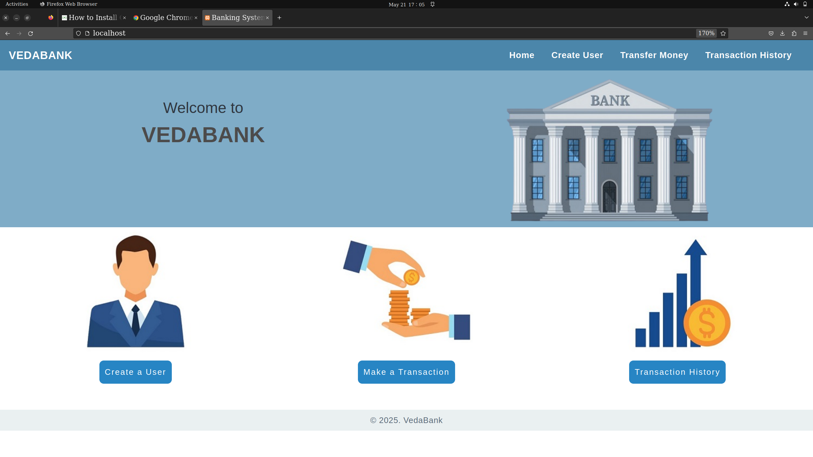
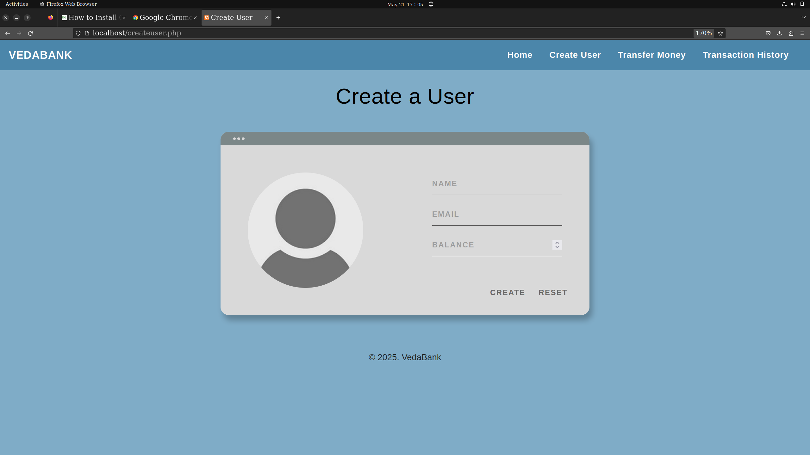
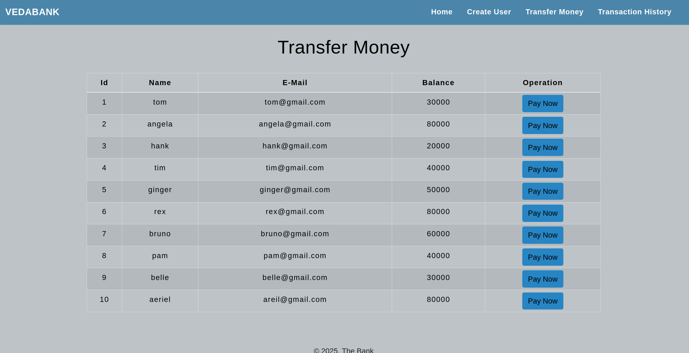
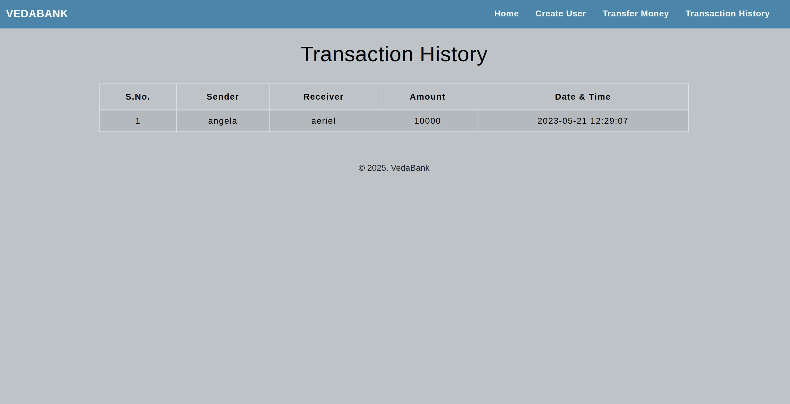

# VedaBank Banking System
Sparks Foundation Internship Project : Basic Banking System  
A Web Application used to transfer money between multiple users.  

Stack used - 
Front-end : HTML, CSS, Bootstrap & Javascript 
Back-end : PHP 
Database : MySQL   

Database contains two Tables- Users Table & Transaction Table 
1. User table have basic fields such as name, email & current balance. 
2. Transaction table records all transfers happened along with their time.  

Flow of the Website: Home Page > View all Users > Select and View one User > Transfer Money > Select reciever > View all Users > View Transfer History.

## Snapshots

### Home Page

### Create User Page

### Transfer page/ All Users Page

### Transaction History

